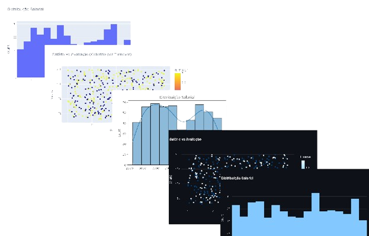

<!-- 
  Tags: DadosIA, Dev
  Label: 📈 Análise Turnover (Python, ML)
  Description: Previsão de Turnover de Funcionários com FastAPI e TensorFlow
  path_hook: hookfigma.hook2, hookfigma.hook7
-->
# Previsão de Turnover de Funcionários com FastAPI e TensorFlow

[](https://www.python.org/downloads/)
[](https://fastapi.tiangolo.com/)
[](https://www.tensorflow.org/)
[](https://opensource.org/licenses/MIT)
[](https://github.com/fabiuniz)


## ✨ Destaques da Minha Contribuição

Este projeto é uma demonstração das minhas habilidades em desenvolver soluções completas, combinando backend e machine learning. Minhas contribuições incluem:

- **Desenvolvimento de API RESTful com FastAPI**: Criei uma API eficiente para prever turnover em tempo real, com endpoints claros e bem documentados.
- **Integração de Machine Learning com TensorFlow**: Conectei um modelo de rede neural treinado à API, desde a concepção até a integração prática.
- **Interface Web Simples**: Configurei o FastAPI para servir arquivos estáticos (`index.html`, `style.css`, `script.js`), oferecendo uma interface acessível no navegador.
- **Lógica de Previsão**: Implementei pré-processamento de dados e integração com o modelo, retornando respostas JSON com a probabilidade de turnover.
- **Habilitação de CORS**: Adicionei middleware para permitir requisições de diferentes origens, facilitando integrações futuras.
- **Código Organizado**: Estruturei o projeto com comentários claros, priorizando legibilidade e manutenibilidade.
- **Aprendizado Contínuo**: Aprofundei conhecimentos em FastAPI, TensorFlow e implantação de modelos, buscando sempre melhorar.

Este projeto reflete minha capacidade de criar soluções práticas e escaláveis. Estou pronto para novos desafios!

## 🚀 Sobre o Projeto

Esta aplicação web utiliza machine learning para prever a probabilidade de turnover de funcionários. Tecnologias utilizadas:

- **FastAPI**: Framework web para APIs rápidas e modernas.
- **TensorFlow**: Biblioteca de machine learning para treinar e integrar o modelo.
- **Pandas**: Manipulação e análise de dados.
- **NumPy**: Computação numérica.
- **Scikit-learn**: Ferramentas de machine learning.
- **Uvicorn**: Servidor ASGI para executar a aplicação.
- **Matplotlib/Seaborn**: Visualização de dados durante o treinamento.

A aplicação carrega dados fictícios, treina uma rede neural e expõe uma API para previsões. Uma interface web simples permite testar a API diretamente no navegador.

## 📂 Estrutura do Projeto

```
turnover/
├── README.md
├── turnover.py              # Script principal com API e lógica de ML
├── dashboard.py             # Script para dashboard (opcional)
├── dashboard_streamlit.py   # Dashboard com Streamlit (opcional)
├── requirements.txt         # Dependências do projeto
├── setup.sh                 # Script para configuração inicial
├── backup.sh                # Script para backup de dados
├── listallpkg.sh            # Script para listar pacotes instalados
├── static/
│   ├── dados_funcionarios.csv   # Dados fictícios de funcionários
│   ├── dados_funcionariosb.csv  # Backup dos dados
│   ├── favicon.ico              # Ícone da interface web
│   ├── index.html               # Página web para interação
│   ├── script.js                # Lógica JavaScript da interface
│   ├── style.css                # Estilos da interface
```

## 🛠️ Pré-requisitos

- **Python 3.9+**: [Download](https://www.python.org/downloads/)
- **pip**: Gerenciador de pacotes (incluso com Python)
- **venv**: Módulo para ambientes virtuais (incluso com Python)
- **Git**: [Download](https://git-scm.com/)
- **Docker** (opcional): [Download](https://www.docker.com/)

## 📦 Dependências

As dependências estão listadas em `requirements.txt`:

```
fastapi>=0.100.0
uvicorn>=0.23.0
pandas>=2.0.0
tensorflow>=2.12.0
numpy>=1.24.0
matplotlib>=3.7.0
seaborn>=0.12.0
scikit-learn>=1.2.0
```

Instale com:

```bash
pip install -r requirements.txt
```

## ⚙️ Instalação

1. **Clonar o Repositório**

```bash
git clone https://github.com/fabiuniz/turnover.git
cd turnover
```

2. **Criar e Ativar Ambiente Virtual**

Linux/macOS:

```bash
python3 -m venv venv
source venv/bin/activate
```

Windows:

```bash
python -m venv venv
venv\Scripts\activate
```

3. **Instalar Dependências**

```bash
pip install -r requirements.txt
```

4. **Configurar Dados Fictícios** (opcional)

O arquivo `static/dados_funcionarios.csv` contém dados fictícios com as colunas `idade`, `salario`, `tempo_empresa`, `avaliacao` e `turnover`. Edite-o para personalizar, se necessário.

5. **Treinar o Modelo**

Execute para treinar a rede neural e salvar como `modelo_turnover.h5`:

```bash
python turnover.py
```

Isso também gera gráficos de curva de aprendizado e histograma salarial.

6. **Executar a Aplicação FastAPI**

Inicie o servidor:

```bash
uvicorn turnover:app --host 0.0.0.0 --port 8000 --reload
```

Acesse a interface web em `http://vmlinuxd:8000` (ou `http://vmlinuxd:8000` se configurado).

**Configuração Opcional do Arquivo `hosts`**

Para usar `http://vmlinuxd:8000`, adicione ao arquivo `hosts`:

- Windows: `C:\Windows\System32\drivers\etc\hosts` (como administrador)
- Linux/macOS: `/etc/hosts` (com `sudo`)

```bash
127.0.0.1 vmlinuxd
```

## 🧪 Testando a Aplicação

### 1. Via Interface Web

- Acesse `http://vmlinuxd:8000`.
- Preencha os campos (idade, salário, tempo de empresa, avaliação).
- Clique no botão de previsão para ver a probabilidade de turnover.

Os arquivos `index.html`, `script.js` e `style.css` em `static/` compõem a interface.

### 2. Via cURL

```bash
curl -X POST "http://vmlinuxd:8000/predict/" -H "Content-Type: application/json" -d '{"idade": 35, "salario": 8500, "tempo_empresa": 5, "avaliacao": 4.2}'
```

**Resposta**:

```json
{
  "idade": 35,
  "salario": 8500.0,
  "tempo_empresa": 5,
  "avaliacao": 4.2,
  "chance_turnover": "XX.XX%"
}
```

### 3. Via Python

```python
import requests
data = {
    "idade": 35,
    "salario": 8500,
    "tempo_empresa": 5,
    "avaliacao": 4.2
}
response = requests.post("http://vmlinuxd:8000/predict/", json=data)
print(response.json())
```

## 🐳 Executando com Docker (Opcional)

1. **Criar `Dockerfile`**

```dockerfile
FROM python:3.9-slim
WORKDIR /app
COPY . .
RUN pip install -r requirements.txt
EXPOSE 8000
CMD ["uvicorn", "turnover:app", "--host", "0.0.0.0", "--port", "8000"]
```

2. **Construir e Executar**

```bash
docker build -t turnover-app .
docker run -p 8000:8000 turnover-app
```

3. **Testar**

Acesse `http://vmlinuxd:8000` ou use cURL/Python.

## 📊 Visualizações

Ao executar `python turnover.py` (não via API), são gerados:

- **Curva de Aprendizado**: Compara acurácia de treino e validação.
- **Histograma Salarial**: Mostra a distribuição de salários.

Os gráficos são exibidos e salvos automaticamente.



## 🔧 Solução de Problemas

- **Erro de Dependências**: Atualize o pip (`pip install --upgrade pip`) e reinstale (`pip install -r requirements.txt`).
- **Modelo Não Carrega**: Verifique se `modelo_turnover.h5` existe. Execute `python turnover.py` para treinar.
- **Erro de CORS**: O middleware permite todas as origens (`allow_origins=["*"]`). Verifique a requisição.
- **Dados Inconsistentes**: Os dados de entrada devem ter `idade` (int), `salario` (float), `tempo_empresa` (int), `avaliacao` (float).

## 🚀 Melhorias Futuras

- Adicionar features ao modelo (ex.: satisfação, horas extras).
- Implementar validação rigorosa na API.
- Criar frontend com React ou Vue.js.
- Otimizar hiperparâmetros do modelo.
- Adicionar testes unitários com `pytest`.
- Integrar banco de dados para armazenar previsões.

## 📜 Licença

Licenciado sob a [MIT License](https://opensource.org/licenses/MIT). **Nota**: Adicione um arquivo `LICENSE` com o texto da licença MIT para consistência.

## 📬 Contato

Para sugestões ou dúvidas, abra uma issue ou contate-me via [GitHub](https://github.com/fabiuniz).

**Resumo**: Este projeto combina FastAPI e TensorFlow para prever turnover, com API robusta e interface web. É modular, documentado e pronto para expansão. Teste e integre! 💡

**Última atualização**: 23 de maio de 2025