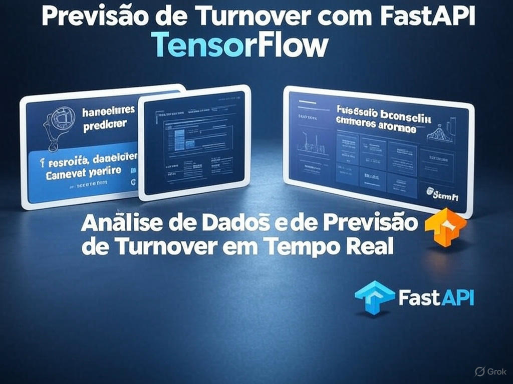

# Previsão de Turnover de Funcionários com FastAPI e TensorFlow

[](https://www.python.org/downloads/)
[](https://fastapi.tiangolo.com/)
[](https://www.tensorflow.org/)
[](https://opensource.org/licenses/MIT)
[](https://github.com/fabiuniz)




## ✨ Destaques da Minha Contribuição

Este projeto não é apenas uma aplicação funcional de previsão de turnover, mas também uma demonstração tangível das minhas habilidades e paixão por construir soluções completas e impactantes. Minha contribuição abrange todo o ciclo de vida da aplicação:

* **Desenvolvimento de API RESTful com FastAPI:** Criei uma API robusta e de alta performance utilizando o poder do FastAPI, garantindo eficiência e facilidade de uso para interações com o modelo de machine learning. A API permite o envio de dados de funcionários e retorna previsões de turnover em tempo real.
* **Integração de Machine Learning com TensorFlow:** Implementei a conexão entre a API e um modelo de rede neural treinado com TensorFlow. Isso demonstra minha capacidade de aplicar conhecimentos de machine learning em um contexto prático, desde a concepção do modelo até sua integração em uma aplicação web.
* **Servindo Conteúdo Estático para Interface de Usuário:** Configurei o FastAPI para servir arquivos estáticos (HTML e CSS), permitindo a criação de uma interface de usuário intuitiva e acessível diretamente no navegador para testar a funcionalidade da API.
* **Lógica de Previsão e Tratamento de Dados:** Desenvolvi a lógica para receber dados de funcionários através de requisições POST na rota `/predict/`, realizar o pré-processamento necessário e alimentar o modelo de machine learning, retornando uma resposta JSON clara com a probabilidade de turnover.
* **Habilitação de CORS para Flexibilidade:** Integrei o middleware de CORS para permitir requisições de diferentes origens, facilitando a integração com futuras aplicações front-end mais complexas.
* **Código Organizado e Documentado:** Estruturei o código de maneira clara e adicionei comentários explicativos, demonstrando minha preocupação com a legibilidade e a manutenibilidade do projeto.
* **Aprendizado e Aprimoramento Contínuos:** Durante o desenvolvimento deste projeto, aprofundei meus conhecimentos em FastAPI, TensorFlow e nas melhores práticas para implantação de modelos de machine learning em aplicações web. Estou sempre buscando aprender e aplicar novas técnicas para criar soluções cada vez mais eficientes e inovadoras.

Acredito que este projeto exemplifica minha capacidade de combinar habilidades de desenvolvimento de backend com conhecimentos de machine learning para criar soluções práticas e orientadas a resultados. Estou ansioso para aplicar minhas habilidades em desafios ainda maiores!

## 🚀 Sobre o Projeto

Este projeto implementa uma aplicação web que utiliza um modelo de machine learning para prever a probabilidade de um funcionário deixar a empresa (turnover). A aplicação é construída utilizando:

* **FastAPI:** Um framework web moderno e de alto desempenho para construir APIs com Python.
* **TensorFlow:** Uma biblioteca de código aberto para machine learning desenvolvida pelo Google.
* **Pandas:** Uma biblioteca para manipulação e análise de dados em Python.
* **NumPy:** Uma biblioteca para computação numérica em Python.
* **Scikit-learn:** Uma biblioteca para ferramentas de machine learning em Python.
* **Uvicorn:** Um servidor ASGI (Asynchronous Server Gateway Interface) rápido como um raio, para executar aplicações FastAPI.

O código carrega dados fictícios de funcionários, treina um modelo de rede neural simples para prever o turnover e expõe uma API para receber dados de novos funcionários e retornar a probabilidade de turnover prevista. Uma interface web simples em HTML é fornecida para interagir com a API.

## 📂 Estrutura do Projeto
```Bash
turnover/
├── README.md
├── turnover.py
├── dashboard.py
├── dashboard_streamlit.py
├── requirements.txt
├── setup.sh
├── backup.sh
├── listallpkg.sh
│   static/
│   ├── dados_funcionarios.csv
│   ├── dados_funcionariosb.csv
│   ├── favicon.ico
│   ├── index.html
│   ├── script.js
│   ├── style.css
```

## 🛠️ Pré-requisitos

Antes de começar, certifique-se de ter as seguintes ferramentas instaladas:

* **Python 3.9+:** Baixe em [python.org](https://www.python.org/downloads/).
* **pip:** Gerenciador de pacotes Python (geralmente incluso com Python).
* **venv:** Módulo para ambientes virtuais (incluso com Python).
* **Git:** Para clonar o repositório. Instale em [git-scm.com](https://git-scm.com/).
* **Docker (Opcional):** Para executar a aplicação em um contêiner. Instale em [docker.com](https://www.docker.com/).

## ⚙️ Instalação

Siga os passos abaixo para configurar e executar a aplicação localmente.

**1. Clonar o Repositório**

Clone o projeto do GitHub e navegue até o diretório:

```Bash
git clone https://github.com/fabiuniz/turnover.git
cd turnover
```

**2. Criar e Ativar um Ambiente Virtual**

Crie um ambiente virtual para isolar as dependências do projeto.

No Linux/macOS:

```Bash
python3 -m venv venv
source venv/bin/activate
```
No Windows:

```Bash
python -m venv venv
venv\Scripts\activate
```
**3. Instalar Dependências**
Instale todas as bibliotecas listadas em requirements.txt:

```Bash
pip install -r requirements.txt
```
Se preferir instalar manualmente:

```Bash
pip install fastapi uvicorn pandas tensorflow numpy matplotlib seaborn scikit-learn
```
**4. Configurar Dados Fictícios (Opcional)**

O arquivo static/dados_funcionarios.csv contém dados fictícios de funcionários. Se ele não existir, o script turnover.py gera dados automaticamente com as colunas idade, salario, tempo_empresa, avaliacao e turnover. Para personalizar os dados, edite este arquivo CSV.

**5. Treinar o Modelo**

O script turnover.py treina automaticamente uma rede neural e salva o modelo como modelo_turnover.h5. Para treinar o modelo manualmente (caso queira re-treinar ou se o arquivo não existir), execute:

```Bash
python turnover.py
```
Este comando também exibirá gráficos da curva de aprendizado e do histograma salarial.

**6. Executar a Aplicação FastAPI**

🛠️ Configuração Opcional do Arquivo hosts

Para acessar funcionalidades via http://vmlinuxd:8000, adicione esta linha ao seu arquivo hosts:
```Bash
Windows: C:\Windows\System32\drivers\etc\hosts (abra como administrador)
Linux/macOS: /etc/hosts (use sudo para editar)
```
Adicione a linha:
```Bash
127.0.0.1 vmlinuxd
```
Isso associa o nome vmlinuxd ao endereço 127.0.0.1 no seu computador, permitindo acesso local facilitado. Salve o arquivo após a modificação. Essa etapa é opcional e útil para acessar os dashboards locais.

Inicie o servidor FastAPI com Uvicorn:

```Bash
uvicorn turnover:app --host 0.0.0.0 --port 8000 --reload
```
A flag --reload ativa a recarga automática do servidor durante o desenvolvimento, o que é útil para ver as alterações no código em tempo real.

Acesse http://vmlinuxd:8000 no seu navegador para visualizar a interface web.

## 🧪 Testando a Aplicação

Você pode testar a aplicação de três maneiras: via interface web, cURL ou Python.

**1. Teste via Interface Web**

Abra http://vmlinuxd:8000 no navegador.
Preencha os campos do formulário (idade, salário, tempo de empresa, avaliação).
Clique no botão de previsão para ver a probabilidade de turnover.

**2. Teste via cURL**

Envie uma requisição POST para a rota /predict/:

```Bash
curl -X POST "http://vmlinuxd:8000/predict/" -H "Content-Type: application/json" -d '{"idade": 35, "salario": 8500, "tempo_empresa": 5, "avaliacao": 4.2}'
```
Resposta esperada:
```Bash
JSON
{
  "idade": 35,
  "salario": 8500.0,
  "tempo_empresa": 5,
  "avaliacao": 4.2,
  "chance_turnover": "XX.XX%"
}
```
**3. Teste via Python**

Use a biblioteca requests para enviar uma requisição à API:

Python
```Bash
import requests
data = {
    "idade": 35,
    "salario": 8500,
    "tempo_empresa": 5,
    "avaliacao": 4.2
}
response = requests.post("http://vmlinuxd:8000/predict/", json=data)
print(response.json())
```
## 🐳 Executando com Docker (Opcional)
Para rodar a aplicação em um contêiner Docker, siga os passos abaixo.

**1. Criar um Dockerfile**

Crie um arquivo chamado Dockerfile no diretório do projeto com o seguinte conteúdo:
```Bash
Dockerfile

FROM python:3.9-slim

WORKDIR /app

COPY . .

RUN pip install -r requirements.txt

EXPOSE 8000

CMD ["uvicorn", "turnover:app", "--host", "0.0.0.0", "--port", "8000"]
```
**2. Construir e Executar o Contêiner**

```Bash
docker build -t turnover-app .
docker run -p 8000:8000 turnover-app
```
**3. Testar**

Acesse http://vmlinuxd:8000 no navegador ou use cURL/Python para testar a API.


## 📊 Visualizações

Ao executar python turnover.py, você verá:

Curva de Aprendizado: Um gráfico comparando a acurácia de treino e validação ao longo das épocas.
Histograma Salarial: Um histograma da distribuição de salários para análise dos dados.
Estes gráficos são exibidos automaticamente durante o treinamento do modelo.


## 🔧 Solução de Problemas

Erro de dependências: Certifique-se de que todas as bibliotecas estão instaladas (pip install -r requirements.txt). Se houver falhas, tente atualizar o pip: pip install --upgrade pip.
Modelo não carrega: Verifique se o arquivo modelo_turnover.h5 existe no diretório. Se não, execute python turnover.py para treinar o modelo.
Erro de CORS: O middleware CORS está configurado para aceitar todas as origens (allow_origins=["*"]). Verifique se a requisição está correta.
Dados inconsistentes: Os dados de entrada devem ter as colunas idade (int), salario (float), tempo_empresa (int) e avaliacao (float), no mesmo formato usado no treinamento.
Erro no script: Se a função defaultvalue() falhar, verifique se as colunas de X correspondem aos dados gerados. Ajuste o código para garantir compatibilidade.

## 🚀 Melhorias Futuras

Adicionar mais features ao modelo (ex.: satisfação no trabalho, horas extras).
Implementar validação de entrada mais rigorosa na API.
Desenvolver uma interface frontend avançada com React ou Vue.js.
Otimizar hiperparâmetros do modelo (ex.: número de camadas, neurônios, taxa de aprendizado).
Adicionar testes unitários com pytest para validar a API e o modelo.
Integrar um banco de dados para armazenar previsões e dados de funcionários.

## 📜 Licença

Este projeto está licenciado sob a MIT License.


## 📬 Contato

Para sugestões, dúvidas ou relatórios de bugs, abra uma issue ou entre em contato via GitHub.

Resumo: Este projeto combina FastAPI e TensorFlow para prever o turnover de funcionários, oferecendo uma API robusta e uma interface web simples. O código é modular, bem documentado e pronto para uso ou expansão. Teste a aplicação e explore como ela pode ser integrada a outros sistemas! 💡

Última atualização: 14 de maio de 2025
